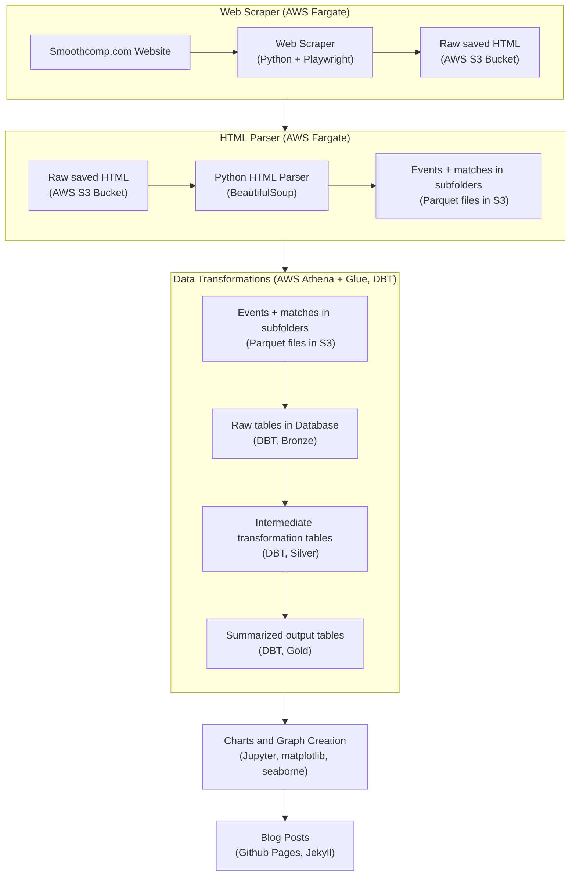

# Introduction

There are many steps that go into taking raw data scraped from web pages to create plots and insights found on this website.
This post will touch on some of the biggest problems faced as well as the tools used to solve them.

At a high level, the main tasks to solve are:
* **Collecting and Parsing Raw Data** from [Smoothcomp](https://smoothcomp.com/en) in an automated and organized way
* **Storing records** in the cloud in a usable format 
* **Transforming raw records** into aggregated and summarized tables
* **Plotting and Graphing** the summarized data to understand data and create actionable insights
* **Delivering Results** using this blog

## Web Scraping and Parsing Raw Data

The two primary web pages to scrape are past events and match results. 
After the initial run to grab 10 years of historical results, new results are downloaded and proccessed every Monday to include the prior week's events. 

### The Tech Stack

AWS Fargate is used to handle this task because:
* The web scraper can take longer than 15 minutes, so AWS lambda will not work.  
The scraper honors smoothcomp's policy that automated tools should take 10 seconds between requests. 

* The web scraper automates a web browser, so a Docker image with Fargate is used to allow for a few more install requirements than just python libraries.

A docker image using python, Playwright, and a headless browser are saved to a separate GitHub repository that uses GitHub actions to automatically deploy
the image to AWS whenever the repository is updated.  From there, the scraper can be ran manually or scheduled to run once a week.

### The Web Pages to Extract

An example of the events search page looks like this:

This project will filter results to only include Jiu-Jitsu matches in the USA from year 2017 and beyond.
**BeautifulSoup** is used to process each web page and extract event and match records. 
Records are saved as parquet files in an AWS S3 bucket using **boto3**.

Each event card on the website will be a record containing:
* The event name and ID 
* The location (as it's written)
* The date of event
* The URL to the event itself, used to find the matches page

After processing each event, the matches from each event are scraped and processed.

From each match, we gather:
* The names and athlete ID's of both competitors
* Athlete club name
* The winner and match outcome, whether it was submission or decision
* skill/belt level
* style (gi or no-gi)
* age (youth, adult, masters)
* gender 

**NOTE:** Weight class is not used because there of the inconsistency in how weight classes are recorded between different events.

### Errors
For events from established federations like Grappling Industries, parsing match attributes is more obvious, but that isn't always the case for other events.
For example, these matches were **<u>not</u>** included because there is no labelled winner:

When a match has two competitors and a defined winner, it is included even if some of the match attributes are missing.  
For example, these matches are included, but do not list a style of gi or no-gi in the match:

These matches happen to be from an ADCC event which is exclusively no-gi. 
Because of the size of ADCC, additional logic was coded into the parsing process so that ADCC events are labelled correctly, but additional work needs to be done
for some of the smaller events.

From 2017-2025, there are **185** HTML event page search results and almost **4,300** events.  
There are over **58,000** HTML match result pages with over **1.7 million** matches.

## Automated Scraping
The scraping pipeline is containerized by adding a dockerfile, and is automatically deployed by GitHub Actions with a deploy.yml file to AWS Elastic Container Registry (ECR).
An ECS task definition defines the runtime configuration for the container, including compute resources, environment variables, and AWS permissions. 
The task is then executed on AWS Fargate, which runs the container without managing servers.

<figure class="image-center">
  
  <figcaption>
    Each commit to GitHub automatically rebuilds and pushes the Docker image to AWS ECR.
  </figcaption>
</figure>

After all of the initial setup, jobs can be triggered manually or scheduled, and logs are streamed to CloudWatch for monitoring.

## Storing records
HTML files are saved as-is to allow re-processing when necessary. BeautifulSoup is used to parse HTML files and create a parquet file for each HTML file.
After, parquet files are combined by year and saved in an **events** or **matches** folder.  
All events and matches are saved in their own subfolder so AWS Athena and Glue can use the entire contents of the folder to create a table that can be queried with Athena.
Athena does have a query editor to allow writing SQL against each bucket for testing purposes, but DBT in VSCode 
handles transforming raw data into deliverable tables that feed into final visualizations.

## Transforming raw records with DBT
* show diagram of all tables using DBT documentation
* talk about the bronze, silver, gold subfolders in DBT. 
Bronze holds matches, events, and dim tables.  
Silver holds transformations rolled up at different levels.
Gold has 1 subfolder for each final blog post.

## Importing and Plotting
Short section showing how Jupyter Notebooks are currently used to read from gold tables to create visualizations.  Talk about how this works for charts 
covering historical plots that won't change, but will move to an orchestration like Airflow or Dagster when charts will need to be refreshed with updated data.

## Delivering Results
Talk about the format of the blog and using Jekyll and github pages.
